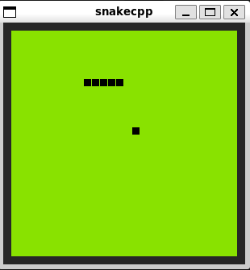

# snakecpp
## Classic Snake using SDL2 in C++

## Prerequisites:
- Linux x86 (e.g., I build this using WSL Ubuntu on windows)
- SDL2

## Setup
### Locally
`make`

### WASM
Install emscripten
`make wasm`
