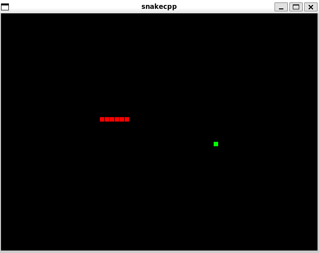

# snakecpp
## Classic Snake using SDL2 in C++

## Pre-requisites:
- Linux x86 (e.g., I build this using WSL Ubuntu on windows)
- SDL2

## Setup
`mkdir build && cd build && cmake .. && cmake --build . && ./snake`
